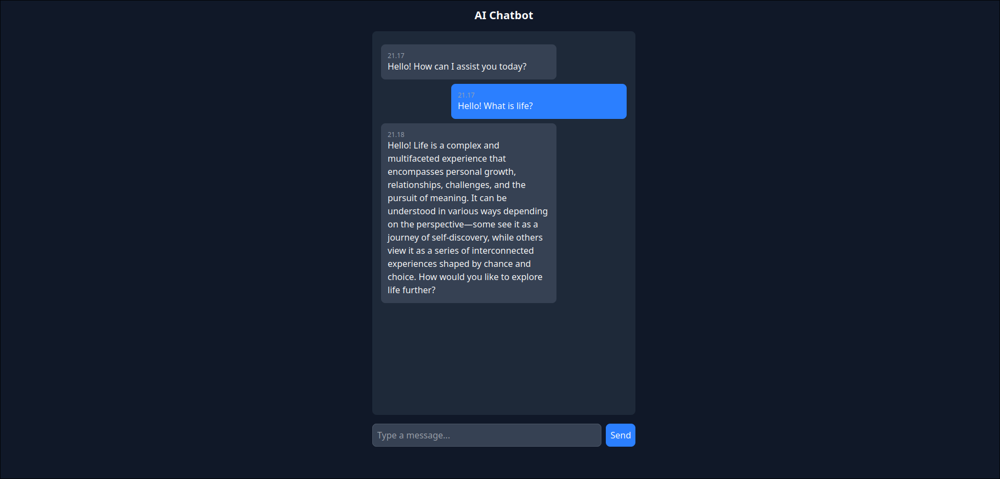

# Local DeepSeek AI Chatbot

A self-hosted AI chatbot running **DeepSeek-R1** with **Ollama**, **Docker**, and **React**.
Revived a **decade-old PC** by installing **Ubuntu Server**, turning outdated hardware into a temporary AI-powered server for self-hosting experiments. 🚀

---

## 📌 Project Core

✅ **Self-hosted AI chatbot**
✅ **Ollama - Local AI model inference**
✅ **DeepSeek-R1 - AI model powering the chatbot**
✅ **Docker & Docker Compose - Containerized deployment**
✅ **Reverse proxy setup using Nginx**
✅ **React + TailwindCSS - Frontend for chatbot UI**
✅ **Ubuntu Server - Lightweight OS for hosting**

---

## 📷 Screenshot

